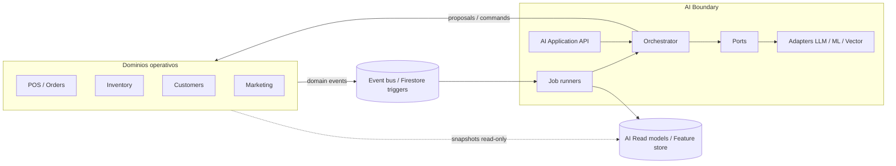
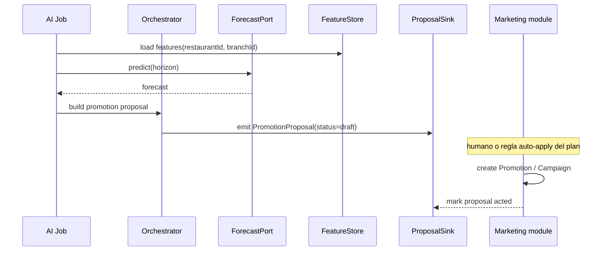
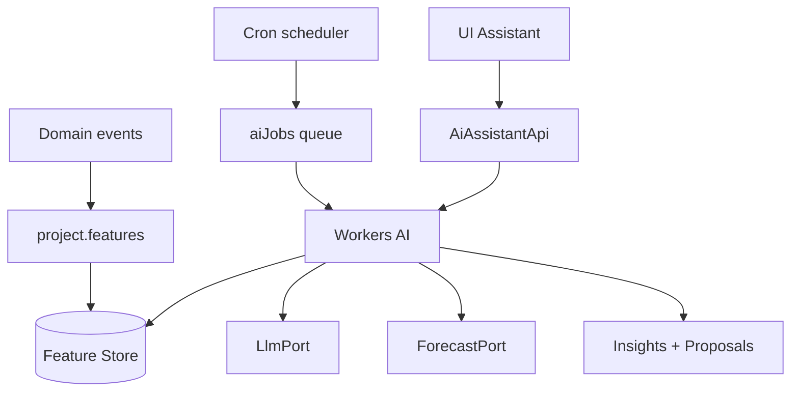

# SmartServe — Arquitectura del módulo de Inteligencia Artificial

> **Solo arquitectura.** Sin implementación.  
> Principio rector: el módulo AI es un **bounded context** desacoplado; el resto del sistema no conoce proveedores LLM/ML ni pipelines internos.  
> Alineado con: `models/FIRESTORE_ARCHITECTURE.md` · `models/RBAC_ARCHITECTURE.md` · planes / entitlements del tenant.  
> **API interna (endpoints):** [`AI_INTERNAL_API.md`](./AI_INTERNAL_API.md)

**Versión:** 1.0.0 · **Estado:** diseño

---

## 1. Objetivo

Dotar a cada restaurante (y opcionalmente cada sucursal) de capacidades de IA que:

1. Predigan ventas e inventario.
2. Asistan por conversación.
3. Analicen clientes.
4. Generen recomendaciones, promociones, alertas y campañas.

Sin acoplar POS, inventario, CRM o marketing a un vendor concreto (OpenAI, Vertex, modelo propio, etc.).

---

## 2. Principios de desacoplamiento

| Principio | Implicación |
|-----------|-------------|
| **Bounded context** | Todo lo “AI” vive bajo `modules/ai` + workers/CF del dominio AI. Otros módulos **no** importan SDKs de modelos. |
| **Ports & adapters** | El núcleo define *ports* (interfaces). Providers (LLM, forecasting, embeddings) son *adapters* intercambiables. |
| **Contratos de lectura** | AI **lee** datos operativos vía **read models / snapshots / eventos**, nunca vía imports cruzados de servicios de negocio. |
| **Contratos de escritura** | AI **propone**; otros módulos **aplican**. Escrituras a pedidos, stock o campañas pasan por APIs/comandos del módulo dueño. |
| **Event-driven** | Señales (`order.paid`, `stock.low`, `customer.updated`) alimentan jobs AI. No hay polling ad-hoc desde UI de otros módulos. |
| **Multi-tenant first** | Toda entidad AI lleva `restaurantId` (+ `branchId` opcional). Ningún job cruza tenants. |
| **Entitlements** | Cupos y features (`aiQueriesPerMonth`, `ai.forecasting`, …) se consultan al snapshot de suscripción; AI no decide pricing. |
| **Observabilidad & coste** | Tokens, latencia y errores se registran en `aiUsage` / telemetría del módulo; el resto solo ve métricas agregadas. |



**Regla de oro:** si un cambio de proveedor LLM obliga a tocar `modules/pos` o `modules/inventory`, el diseño está roto.

---

## 3. Mapa de capacidades

| Capacidad | Código interno | Entrada principal | Salida principal |
|-----------|----------------|-------------------|------------------|
| Predicción de ventas | `forecast.sales` | series de ventas, calendario, clima opcional | forecast + intervalos |
| Predicción de inventario | `forecast.inventory` | stock, recetas, forecast de ventas, lead times | proyección de quiebre / pedido sugerido |
| Asistente conversacional | `assistant.chat` | sesión + mensaje + tools allowlist | respuesta + tool calls |
| Análisis de clientes | `analytics.customers` | RFM, tickets, segmentos | perfiles / clusters / insights |
| Recomendaciones automáticas | `recs.ops` | KPIs, anomalías, contexto plan | lista priorizada de acciones |
| Promociones automáticas | `promo.suggest` | margen, rotación, forecast, reglas negocio | borradores de promoción |
| Alertas inteligentes | `alerts.smart` | umbrales + anomalías + forecast | `AiInsight` / notificaciones tipadas `ai` |
| Generación de campañas | `campaign.generate` | segmento + objetivo + tono marca | borrador de campaña + copy + schedule sugerido |

Todas las capacidades comparten: **contexto tenant**, **auditoría**, **confianza (`confidence`)**, **trazabilidad** (`sourceJobId`, `modelId`, `featureSnapshotId`).

---

## 4. Capas internas del módulo

```
modules/ai/
├── domain/           # Tipos, invariantes, políticas (sin I/O)
├── application/      # Casos de uso / orquestación
├── ports/            # Interfaces: LlmPort, ForecastPort, EmbeddingPort,
│                     # FeatureStorePort, EventPublisherPort, ProposalSinkPort
├── adapters/         # Implementaciones (OpenAI, local, mock, BigQuery, …)
├── jobs/             # Schedulers y handlers de eventos
├── read-models/      # Proyecciones AI-only (features agregadas)
└── api/              # Facade pública hacia UI / BFF / Cloud Functions
```

### 4.1 Facade pública (único punto de entrada)

Contratos estables que **sí** puede consumir la app (BFF / CF callable / Route Handlers).  
Catálogo HTTP completo: [`AI_INTERNAL_API.md`](./AI_INTERNAL_API.md) (`/api/internal/v1/ai`).

| API | Uso |
|-----|-----|
| `AiAssistantApi` | crear sesión, enviar mensaje, listar historial |
| `AiInsightsApi` | listar / marcar seen / dismiss / act |
| `AiForecastApi` | consultar últimos forecasts (solo lectura) |
| `AiProposalApi` | listar propuestas (promo/campaña/recomendación) y aceptar/rechazar |
| `AiAdminApi` | config tenant AI, límites, provider override (roles altos) |

Ningún otro módulo llama a `adapters/*` ni a SDKs externos.

### 4.2 Ports (contratos internos)

| Port | Responsabilidad |
|------|-----------------|
| `LlmPort` | chat, structured output, tools |
| `ForecastPort` | series → predicción (puede ser modelo estadístico, no LLM) |
| `EmbeddingPort` | vectores para memoria / RAG |
| `FeatureStorePort` | leer/escribir features agregadas del tenant |
| `OperationalReadPort` | leer snapshots/eventos normalizados (no entidades vivas del POS) |
| `ProposalSinkPort` | emitir propuestas tipadas hacia Marketing / Inventory / Notifications |
| `UsageMeterPort` | incrementar `aiUsage` y chequear límites |
| `AuditPort` | registrar acciones sensibles |

---

## 5. Contratos con el resto del sistema

### 5.1 Qué AI **consume** (solo lectura / eventos)

| Fuente | Forma de acceso | Nunca |
|--------|-----------------|-------|
| Pedidos / pagos | eventos `order.paid`, agregados diarios | mutar pedidos |
| Inventario | eventos `stock.changed`, snapshot niveles | ajustar stock directo |
| Clientes / loyalty | eventos + agregados RFM | borrar clientes |
| Reservas | conteos / no-shows | |
| Promociones / campañas existentes | catálogo + performance | publicar sin aprobación |
| Settings / brand | tono, idioma, moneda, timezone | |

Los agregados viven en un **Feature Store AI** (colecciones propias o tablas analíticas). El POS no escribe ahí; un **projector** del módulo AI lo hace al recibir eventos.

### 5.2 Qué AI **emite** (propuestas y señales)

| Emisión | Destino | Semántica |
|---------|---------|-----------|
| `AiInsight` | Firestore `aiInsights` + opcional `notifications` | informativo / accionable |
| `PromotionProposal` | cola / colección `aiProposals` → Marketing aplica | borrador |
| `CampaignDraft` | idem → Marketing | borrador |
| `PurchaseSuggestion` | Inventory / Purchasing (futuro) | sugerencia de pedido |
| `RecommendationCard` | Dashboard / Inbox AI | UI-only hasta que el usuario actúe |

**Aceptar** una propuesta es un comando del módulo dueño (`marketing.acceptAiCampaign`, `inventory.acceptReorderSuggestion`), no un write opaco desde AI.



---

## 6. Diseño por capacidad

### 6.1 Predicción de ventas (`forecast.sales`)

**Problema:** estimar ingresos / tickets / unidades por franja (hora/día) a horizonte 7–30 días.

**Entradas (features):**
- Ventas históricas agregadas (`branchId`, `day`, `hour`, `channel`, `category`).
- Calendario (festivos, eventos locales opcionales).
- Factores: clima (opcional, adapter externo), promociones activas.

**Proceso:**
1. Projector actualiza series en Feature Store.
2. Job programado (p.ej. diario 03:00 timezone del tenant) invoca `ForecastPort`.
3. Persistencia: `aiForecasts/{forecastId}` con series + intervalo de confianza.
4. Emite insights solo si hay desviación material vs plan o vs baseline.

**Salida:**
```text
AiForecast {
  kind: 'sales'
  restaurantId, branchId?
  horizonDays
  grain: 'hour' | 'day'
  points: [{ at, value, lower, upper }]
  modelId, trainedAt, confidence
}
```

**Desacoplamiento:** el Dashboard lee `AiForecastApi`; no conoce el algoritmo (Prophet / TFT / LLM-as-judge está prohibido como único motor de series).

---

### 6.2 Predicción de inventario (`forecast.inventory`)

**Problema:** anticipar quiebres y sugerir reposición.

**Entradas:**
- Niveles actuales + lead time + min/max / par levels.
- Recetas (BOM) × forecast de ventas por producto.
- Merma histórica, estacionalidad.

**Proceso:**
1. Combinar `forecast.sales` (o demanda por SKU) con BOM → demanda de ingredientes.
2. Simular depleción día a día.
3. Generar `PurchaseSuggestion` / insight `stock_prediction` cuando `daysOfCover < threshold`.

**Salida:** proyección por `ingredientId` + fecha estimada de quiebre + cantidad sugerida.

**Desacoplamiento:** Inventory permanece dueño de movimientos; AI solo propone.

---

### 6.3 Asistente conversacional (`assistant.chat`)

**Problema:** chat contextual multi-turno para gerente/propietario (y roles con `ai.assistant`).

**Componentes:**
- `aiSessions` + `messages` (ya previstos en Firestore).
- **RAG / tools** con allowlist por rol y plan.
- **System prompt** tenant: nombre, timezone, moneda, políticas (no inventar stock).

**Tools permitidos (ejemplos, todos read-only salvo acciones explícitas):**

| Tool | Permiso | Efecto |
|------|---------|--------|
| `get_sales_summary` | `ai.assistant` | lee agregados |
| `get_low_stock` | `ai.assistant` | lee snapshot |
| `get_forecast` | `ai.insights` | lee forecasts |
| `list_insights` | `ai.insights` | |
| `draft_promotion` | `ai.manage` o marketing.* | crea **proposal**, no promo live |
| `draft_campaign` | marketing + ai | idem |

**Guardrails:**
- PII: enmascarar datos de clientes en prompts salvo necesidad y permiso.
- Grounding: respuestas numéricas deben citar `contextRefs`.
- Rate limit: `UsageMeterPort` antes de cada llamada LLM.
- No tool de “borrar datos” o “refund” sin flujo humano aparte.

**Desacoplamiento:** el asistente habla con tools del port `OperationalReadPort` / `ProposalSinkPort`, no con Firestore paths hardcodeados en el adapter LLM.

---

### 6.4 Análisis de clientes (`analytics.customers`)

**Problema:** entender valor, riesgo de churn, afinidades y segmentos accionables.

**Entradas:** tickets, frecuencia, ticket medio, categorías, canales, loyalty, no-shows.

**Salidas:**
- Segmentos (`vip`, `at_risk`, `new`, `dormant`, …) materializados en Feature Store o colección `aiCustomerProfiles`.
- Insights periódicos (“12 clientes VIP sin visita en 30 días”).
- Inputs para campañas y promociones automáticas.

**Privacidad:** perfiles agregados preferibles a PII en prompts; IDs opacos en LLM.

---

### 6.5 Recomendaciones automáticas (`recs.ops`)

**Problema:** priorizar 3–10 acciones diarias para el operador (no un dump de métricas).

**Motor de reglas + score:**
- Señales: caída de ventas, stock crítico, forecast pico, churn, margen bajo en top sellers.
- Cada recomendación: `title`, `rationale`, `impactScore`, `effort`, `deepLink` (ruta UI), `proposalRef?`.

**Persistencia:** como `AiInsight` tipo `recommendation` o entidad `aiRecommendations`.

**Desacoplamiento:** deep links son rutas de producto; la acción concreta la ejecuta el usuario en el módulo destino.

---

### 6.6 Promociones automáticas (`promo.suggest`)

**Problema:** proponer promos con sentido de negocio (margen, rotación, forecast).

**Políticas (domain):**
- No sugerir descuento > X% sin aprobación (config tenant).
- Evitar canibalizar producto estrella sin holgura de margen.
- Respetar `entitlements` de marketing.

**Salida:** `PromotionProposal` con: productos, ventana, canal, copy sugerido, KPI esperado (uplift estimado, baja confianza = solo borrador).

**Auto-apply:** solo si el plan/settings lo habilita (`ai.autoApplyPromotions`); por defecto **human-in-the-loop**.

---

### 6.7 Alertas inteligentes (`alerts.smart`)

**Problema:** alertar por anomalía o riesgo futuro, no por umbral ciego únicamente.

**Tipos:**
- Anomalía de ventas (vs forecast o vs misma franja semana anterior).
- Quiebre proyectado.
- Pico de demanda inminente (staffing hint — informativo).
- Campaña con CTR anormalmente bajo (si hay datos).
- Gasto AI cerca del cupo.

**Canal:**
1. `aiInsights` (inbox AI).
2. Opcional: `notifications` con `type: 'ai'` (ya en modelo Firestore).
3. Digest diario (email/push) según preferencias.

**Dedup:** misma huella (`fingerprint = hash(type, entity, day)`) no re-alerta en ventana T.

---

### 6.8 Generación automática de campañas (`campaign.generate`)

**Problema:** crear borradores de campaña (segmento + mensaje + schedule + canal).

**Pipeline:**
1. Elegir objetivo (`winback` | `upsell` | `new_product` | `slow_mover`).
2. Seleccionar segmento desde `analytics.customers`.
3. LLM genera copy multi-canal (email / WhatsApp / push) con brand voice.
4. Validar longitud/canal y compliance (opt-in).
5. Emitir `CampaignDraft` → Marketing revisa / programa.

**Desacoplamiento:** el envío real, cupos de email y recipients siguen en Marketing (`campaigns`, `campaignRecipients`).

---

## 7. Modelo de datos (extensión AI)

Complementa la sección 18 de Firestore. Colecciones **propiedad del bounded context AI**:

| Colección | Rol |
|-----------|-----|
| `aiSessions` / `messages` | chat |
| `aiInsights` | alertas, recomendaciones, hallazgos |
| `aiUsage` | metering por periodo |
| `aiForecasts` | series sales/inventory |
| `aiProposals` | borradores promo/campaña/reorden |
| `aiCustomerProfiles` | segmentos / scores (sin PII innecesaria) |
| `aiFeatureSnapshots` | puntos de features usados (reproducibilidad) |
| `aiJobs` | estado de jobs (queued/running/failed/succeeded) |
| `aiSettings` | config tenant: provider, auto-apply flags, umbrales, idioma |

Todas con `restaurantId`, soft-delete/timestamps según estándar del proyecto.

**Propuestas (`aiProposals`) — forma conceptual:**

```text
AiProposal {
  id, restaurantId, branchId?
  kind: 'promotion' | 'campaign' | 'reorder' | 'recommendation'
  status: 'draft' | 'accepted' | 'rejected' | 'expired' | 'auto_applied'
  title, summary, payload  // shape por kind
  confidence, modelId, jobId
  expiresAt
  decidedBy?, decidedAt?, linkedEntityRef?  // promoId / campaignId
}
```

---

## 8. Orquestación y jobs

| Job | Trigger | Capacidad |
|-----|---------|-----------|
| `sales-forecast.daily` | cron timezone tenant | `forecast.sales` |
| `inventory-forecast.daily` | tras sales-forecast o cron | `forecast.inventory` |
| `customer-analytics.weekly` | cron | `analytics.customers` |
| `recs.refresh` | cron / tras forecasts | `recs.ops` |
| `promo.suggest` | cron / evento slow-mover | `promo.suggest` |
| `alerts.scan` | cada N min / on event | `alerts.smart` |
| `campaign.generate` | cron / comando admin | `campaign.generate` |
| `assistant.turn` | request usuario | `assistant.chat` |
| `project.features` | domain events | Feature Store |

**Idempotencia:** `jobKey = ${type}:${restaurantId}:${period}` con estado en `aiJobs`.

**Aislamiento:** un worker procesa un tenant a la vez por shard; fallos no bloquean otros tenants.



---

## 9. Seguridad, RBAC y planes

Permisos (ampliar catálogo existente):

| Permiso | Alcance |
|---------|---------|
| `ai.assistant` | chat |
| `ai.insights` | ver insights/forecasts/recomendaciones |
| `ai.proposals.manage` | aceptar/rechazar propuestas |
| `ai.manage` | settings, auto-apply, providers |
| `ai.admin` | super_admin / soporte plataforma |

**Planes (entitlements sugeridos):**

| Feature flag | Free | Starter | Business | Pro+ |
|--------------|------|---------|----------|------|
| Assistant (N queries/mes) | bajo | medio | alto | alto |
| Forecasts | — / básico | básico | completo | completo |
| Auto promos | — | draft only | draft | auto opcional |
| Campaign generate | — | — | draft | draft + A/B copy |
| Customer analytics | — | básico | completo | completo |

AI consulta `subscription.limits.aiQueriesPerMonth` vía `UsageMeterPort`; si excede → error de dominio `AiQuotaExceeded` (la UI lo traduce).

---

## 10. Estrategia de providers (adapters)

| Concern | Adapter A (default) | Adapter B (alternativa) |
|---------|---------------------|-------------------------|
| Chat / copy / campañas | LLM cloud (OpenAI-compatible) | Vertex / Anthropic |
| Forecast series | Modelo estadístico / ML tabular | Servicio externo |
| Embeddings | mismo vendor LLM | local |
| Dev / CI | `MockLlmPort` + fixtures | — |

Selección por `aiSettings.provider` o config de plataforma. El **application layer** solo habla ports.

---

## 11. Fronteras anti-acoplamiento (checklist)

**Prohibido:**
- Importar `openai` / SDK ML desde `modules/pos`, `inventory`, `marketing`, `dashboard`.
- Que Marketing cree campañas leyendo prompts crudos del LLM.
- Que AI escriba `orders` o `inventoryLevels` directamente.
- Compartir tipos internos de adapters fuera de `modules/ai`.

**Permitido:**
- Dashboard → `AiInsightsApi` / `AiForecastApi`.
- Marketing → suscribirse a propuestas `kind=campaign|promotion` y aplicar.
- Inventory → aplicar `reorder` proposals.
- Eventos de dominio genéricos en bus compartido (payload estable versionado).

**Versionado de contratos:** eventos y proposals llevan `schemaVersion`. Cambios breaking → nuevo version, projector dual temporal.

---

## 12. UX (solo referencia de superficie; no implementación)

| Superficie | Contenido |
|------------|-----------|
| `/ai` Inbox | insights + recomendaciones + propuestas pendientes |
| `/ai/assistant` | chat |
| `/ai/forecasts` | ventas / inventario |
| `/ai/customers` | segmentos y hallazgos |
| Deep links | desde insight → módulo operativo |

Wireframes detallados pueden vivir en `docs/UX_WIREFRAMES.md` cuando se diseñe pantalla; este doc no define UI.

---

## 13. Observabilidad y calidad

- **Métricas:** latencia p95 por capability, tokens, coste estimado, tasa de aceptación de proposals, falsos positivos de alertas.
- **Evaluación offline:** golden sets de prompts y forecasts (MAPE) por tenant de demo.
- **Human feedback:** thumbs / dismiss reason en insights → reentrenamiento / ajuste de umbrales.
- **Retención:** mensajes y feature snapshots según plan; export analítico Enterprise.

---

## 14. Roadmap de implementación (futuro; no hacer ahora)

| Fase | Entregar |
|------|----------|
| **A — Foundation** | ports, usage meter, sessions/messages, insights CRUD, mock adapters |
| **B — Forecasts** | projectors + sales/inventory forecast jobs + UI lectura |
| **C — Assistant** | tools read-only + grounding + quotas |
| **D — Intelligence loop** | customer analytics, recs, smart alerts |
| **E — Generative growth** | promo/campaign proposals + accept flow en Marketing |
| **F — Auto-pilot** | auto-apply opt-in, evaluación, multi-branch tuning |

---

## 15. Resumen ejecutivo

El módulo AI es un **contexto aislado** con:

1. **Facade** estable hacia la app.  
2. **Ports** para LLM/ML/features.  
3. **Lectura** por eventos + feature store.  
4. **Escritura** solo como **propuestas** e **insights**.  
5. Ocho capacidades cubiertas sin mezclar lógica en POS/CRM/Marketing.  
6. Multi-tenant, RBAC y cupos de plan como puertas de entrada, no como afterthought.

Cuando se autorice programar, la primera entrega debe ser la **Foundation (Fase A)** sin conectar aún generación de campañas en producción.
