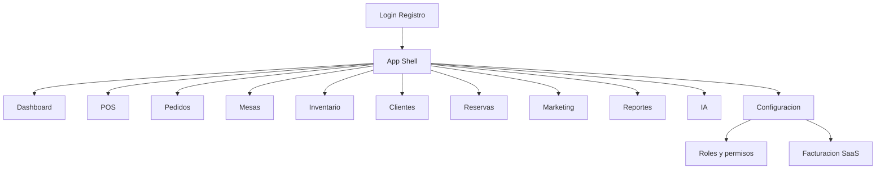

# SmartServe AI — UX Wireframes (experiencia completa)

> Solo diseño. Sin implementación.  
> Línea visual: premium, espacial, calmada — inspiración Stripe · Notion · Apple · Square · Toast POS.  
> Versión: **1.0.1**

---

## 1. Sistema visual (línea premium)

### Dirección
- **Mucho aire**: márgenes generosos, una idea dominante por viewport.
- **Tipografía**: display con carácter + body limpia (evitar Inter/Roboto/Arial por defecto).
- **Color**: neutros piedra/tinta + **un acento vegetal** (verde bosque). Sin morados genéricos ni glow.
- **Fondos**: gradiente muy sutil + ruido casi invisible (no plano muerto).
- **Superficies**: borde fino, radio 14–20px, una sola sombra suave. Cards solo si hay interacción.
- **Motion**: fade-up al entrar, hover lift 1px, skeleton pulse.
- **Modos**: claro y oscuro con los mismos tokens.

### Shell global

```text
+------------------------------------------------------------------+
| TOPBAR  SmartServe    [Sucursal v]  [Tema]  Rol · User   [Salir] |
+----------+-------------------------------------------------------+
| SIDEBAR  |                                                       |
| Dashboard|                 MAIN CONTENT                          |
| POS      |                                                       |
| Pedidos  |                                                       |
| Mesas    |                                                       |
| Inventario                                                       |
| Clientes |                                                       |
| Reservas |                                                       |
| Marketing|                                                       |
| Reportes |                                                       |
| IA       |                                                       |
| Config   |                                                       |
+----------+-------------------------------------------------------+
| MOBILE NAV (<md): Home · POS · Pedidos · Mas                     |
+------------------------------------------------------------------+
```

Banner global fino (trial / past_due). Toasts abajo-derecha.

---

## 2. Dashboard

**Propósito:** pulso del día en una mirada.

```text
+-- Dashboard -------------------------------- [Sucursal: Todas v] --+
| Titulo: Pulso de Cafe Norte                                         |
|                                                                     |
| +----------+ +----------+ +----------+ +----------+                 |
| | Ingresos | | Pedidos  | | Mesas    | | Alertas  |                 |
| |  1.240e  | |    48    | |    6     | |    3     |                 |
| +----------+ +----------+ +----------+ +----------+                 |
|                                                                     |
| +-- Ventas por hora ----------------+ +-- Alertas --------------+  |
| |          area chart               | | stock leche bajo        |  |
| |                                   | | insight promo cafe      |  |
| +-----------------------------------+ +-------------------------+  |
|                                                                     |
| +-- Resumen operativo ------------------------------------------+  |
| | abiertos · reservas · clientes · ticket medio                 |  |
| +---------------------------------------------------------------+  |
+---------------------------------------------------------------------+
```

**Interacciones:** filtro sucursal; clic alerta -> Inventario/IA.  
**Empty:** mensaje calmado sin ilustraciones infantiles.  
**Mobile:** KPIs 2x2; grafico full-width.

---

## 3. POS

**Propósito:** cobrar sin friccion. Velocidad de dedo.

```text
+-- POS --------------------------------------------------------------+
| PLANO DE MESAS                    | TICKET · Mesa 4                 |
| +----+ +----+ +----+ +----+       | 2x Burger              23,00    |
| | M1 | | M2 | | M3 | | M4 |       | 1x Espresso             1,80    |
| |libre| |42e | |18e | |act.|       | ----------------------------    |
| +----+ +----+ +----+ +----+       | Subtotal               24,80    |
| +----+ +----+ +----+ +----+       | Desc% [0]   Propina% [10]       |
| | M5 | | M6 | | M7 | | M8 |       | TOTAL                  27,28    |
| +----+ +----+ +----+ +----+       |                                 |
|                                   | Categorias: Cafe | Platos | Beb |
|                                   | [grid productos táctil]         |
|                                   | [Enviar cocina]                 |
|                                   | [Mover] [Unir] [Imprimir]       |
|                                   | [Efectivo] [Tarjeta]            |
+-----------------------------------+---------------------------------+
```

**Flujos:** abrir mesa -> anadir items -> cocina -> cobrar -> mesa libre.  
**Modales:** mover, unir, dividir, metodo de pago.  
**Tablet:** plano full; ticket en sheet inferior al seleccionar mesa.

---

## 4. Pedidos

**Propósito:** cola operativa multi-canal.

```text
+-- Pedidos ------------- [Hoy v] [Canal v] [Estado v] [Buscar] ------+
| Tabs: Todos · Abiertos · Cocina · Delivery · Pagados                 |
|                                                                      |
| +-- #A192  Mesa 4 · POS · Preparando ---------- 14:02 · 27,28e ---+ |
| | 2x Burger · 1x Espresso                        [Ver] [Cocina]    | |
| +------------------------------------------------------------------+ |
| +-- #A193  Delivery · En camino ----------------- 14:05 · 18,50e ---+ |
| | Juan P. · direccion…                           [Seguimiento]     | |
| +------------------------------------------------------------------+ |
+----------------------------------------------------------------------+
```

**Detalle (drawer):**
```text
+-- Pedido #A192 ----------------------+
| Estado: En cola -> Preparando -> Listo|
| Mesa 4 · Mesero: Maria               |
| Items…                               |
| Timeline de eventos                  |
| [Imprimir] [Reembolsar*] [Cancelar*] |
+--------------------------------------+
```
\* Segun RBAC.

---

## 5. Mesas

**Propósito:** configurar/supervisar plano (no cobrar).

```text
+-- Mesas --------------------- [Sucursal v] [+ Nueva mesa] ----------+
| Toggle: [Plano] [Lista]                                              |
|                                                                      |
| PLANO: drag mesas · zonas Terraza/Interior · click = panel lateral   |
| LISTA: Nombre | Zona | Pax | Estado | Pedido | Acciones              |
+----------------------------------------------------------------------+
```

**Estados color:** libre / ocupada / reservada / sucia.

---

## 6. Inventario

**Propósito:** stock, movimientos, compras, merma, proveedores.

```text
+-- Inventario -- Tabs: Stock | Movimientos | Compras | Merma | Prov. --+
| [+ Ingrediente] [Registrar merma] [Nueva compra]                      |
|                                                                       |
| Tabla: Ingrediente | Sucursal | Stock | Min | Estado | Coste | ...    |
| Leche | Main | 2.1 L | 3 | Reponer | 1,20 | Ajustar                   |
|                                                                       |
| Lateral: "A reponer hoy" + hint prediccion IA (si plan)               |
+-----------------------------------------------------------------------+
```

**Modal ajuste:** cantidad · motivo · confirmar (tono warning si critico).

---

## 7. Clientes

**Propósito:** CRM + fidelizacion.

```text
+-- Clientes ---------------------- [Buscar] [+ Cliente] --------------+
| LISTA 40%                         | FICHA 60%                         |
| Ana Garcia           120 pts      | Ana Garcia                        |
| Carlos Ruiz           45 pts      | email · telefono · cumple         |
|                                   | +------+ +------+                 |
|                                   | |Puntos| | Tier |                 |
|                                   | +------+ +------+                 |
|                                   | Favoritos · Tags                  |
|                                   | Historial (timeline)              |
|                                   | [Ajustar puntos*] [Nueva reserva] |
+-----------------------------------+-----------------------------------+
```

**Mobile:** lista -> tap -> ficha fullscreen.

---

## 8. Reservas

**Propósito:** calendario semanal + estados.

```text
+-- Reservas ----------- [Semana] [Sucursal v] [+ Reserva] ------------+
| Lun 19   Mar 20   Mie 21   Jue 22   Vie 23   Sab 24   Dom 25          |
| +-----+  +-----+  +-----+                                             |
| |20:00|  |     |  |13:00|                                             |
| |Ana 4|  |     |  |Luis2|                                             |
| +-----+  +-----+  +-----+                                             |
|                                                                       |
| Dia seleccionado:                                                     |
| 20:00 Ana Garcia  4 pax  Mesa 3  [Confirmada v]  [Recordatorio]       |
+-----------------------------------------------------------------------+
```

**Modal:** cliente · pax · fecha/hora · mesa · notas · canal.

---

## 9. Configuracion

**Propósito:** sistema, equipo, RBAC, pagos, billing.

```text
+-- Configuracion -----------------------------------------------------+
| Nav secundaria          | Contenido                                   |
| · General               | Nombre, logo, timezone, moneda              |
| · Sucursales            | Lista + crear                               |
| · Equipo                | Miembros, invitaciones                     |
| · Roles y permisos      | Matriz de switches RBAC                    |
| · POS / Cocina          | Tips, impuestos, sonido KDS                |
| · Pagos                 | Stripe / SumUp                             |
| · Facturacion SaaS      | Plan, uso, portal                          |
| · Notificaciones        | Canales                                    |
| · IA                    | Limites / modelo                           |
+----------------------------------------------------------------------+
```

**Roles y permisos:**
```text
+-- Rol: Gerente ------------------------------------------------------+
| Grupo POS                                                            |
| [x] pos.access   [x] pos.discount   [ ] orders.refund                |
| Cada fila = un permiso · switch individual · icono si dangerous      |
|                                              [Guardar cambios]       |
+----------------------------------------------------------------------+
```

---

## 10. IA

**Propósito:** asistente + insights.

```text
+-- Asistente IA ------------------------------------------------------+
| Prompts (izq)              | Chat (der)                               |
| Por que bajaron ventas?    | IA: Hoy el ticket medio…                 |
| Que debo comprar?          | Tu: Y el stock de leche?                 |
| Que promocionar?           | IA: …                                    |
|                            | [ Escribe…                    ] [Enviar] |
|                                                                       |
| Tab Insights: prediccion stock · promo sugerida · empleado top        |
+-----------------------------------------------------------------------+
```

Burbujas limpias, sin glow. Prompts como lista quieta.

---

## 11. Marketing

**Propósito:** cupones, campanas, canales.

```text
+-- Marketing ---- Tabs: Campanas | Cupones | Automaciones -------------+
| [+ Campana]                                                            |
|                                                                        |
| Campana "Happy Hour" · email · borrador · stats enviados/abiertos      |
| Cupon BIENVENIDA10 · 10% · Activo · 3 usos                             |
|                                                                        |
| Wizard: Audiencia -> Canal -> Contenido -> Programar                   |
+------------------------------------------------------------------------+
```

---

## 12. Reportes

**Propósito:** analisis mas alla del dia.

```text
+-- Reportes ---- [Rango 7d v] [Sucursal v] [Exportar CSV] -------------+
| Tabs: Ventas | Productos | Empleados | Sucursales | Fiscal             |
|                                                                        |
| KPI: Ingresos · Ticket · Pedidos · Margen                              |
| +-- Grafico principal --------+ +-- Top productos ------------------+ |
| | barras / lineas             | | 1. Burger                         | |
| +-----------------------------+ +-----------------------------------+ |
| Tabla detalle sortable                                                 |
+------------------------------------------------------------------------+
```

---

## 13. Mapa de navegacion



---

## 14. Patrones transversales

| Patron | Uso |
|--------|-----|
| Page header | Titulo display + 1 frase + acciones |
| Empty | Borde dashed, copy corto |
| Skeleton | Bloques suaves |
| Filtros | Selects discretos, sin chip-clouds |
| Modales | Centrados, Escape cierra |
| Tablas | Densidad media, acciones al final |
| RBAC | Ocultar CTA si no hay permiso |
| Destructivo | Confirmacion con verbo claro |

---

## 15. Orden de construccion UI (cuando se implemente)

1. Shell + Dashboard  
2. POS + Mesas + Pedidos  
3. Inventario  
4. Clientes + Reservas  
5. Config (equipo + roles)  
6. Marketing + Reportes + IA  

---

## 16. Anti-patrones (evitar)

- Stats strips en hero  
- Badges flotantes sobre plano POS  
- Multiples CTAs compitiendo  
- Cards decorativas sin interaccion  
- Pills de color tipo “AI purple”  

---

*Wireframes de producto. Implementacion UI solo cuando se pida.*
