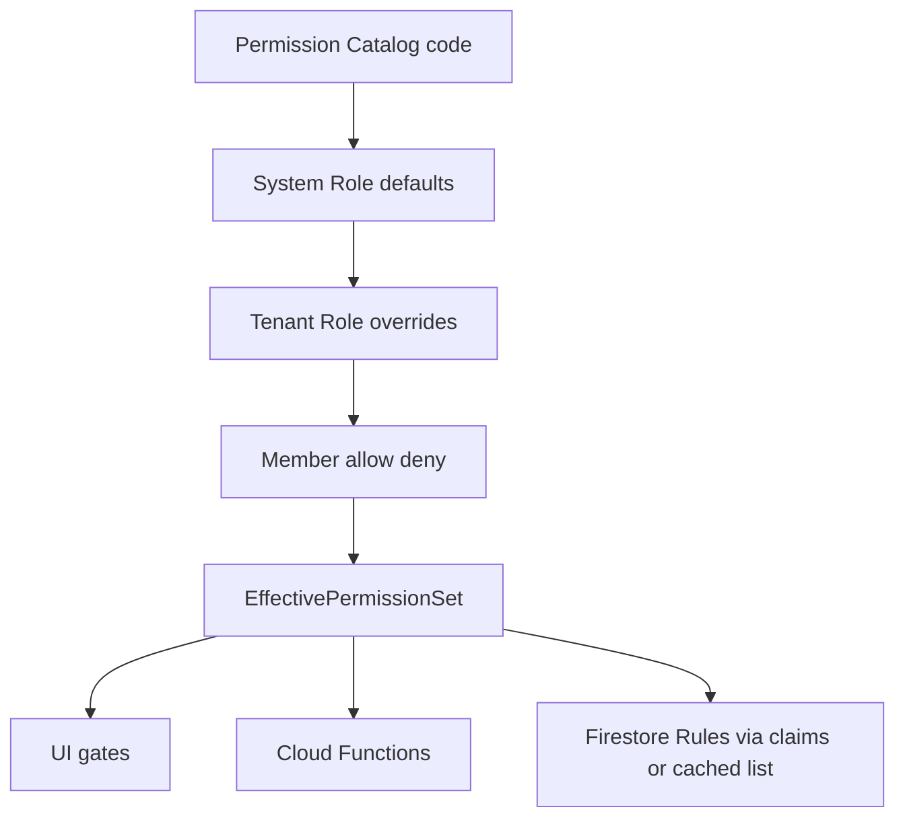

# SmartServe AI — Sistema RBAC profesional

> Role-Based Access Control con permisos individuales activables/desactivables.  
> Escala: miles de restaurantes, roles custom por tenant, overrides por miembro.  
> Versión: **1.0.0** — Solo arquitectura + catálogo en código (`lib/rbac`, `types/rbac.ts`).

---

## 1. Principios

| Principio | Detalle |
|-----------|---------|
| Least privilege | Cada rol empieza con el mínimo necesario |
| Permiso atómico | Unidad = `module.action` (boolean on/off) |
| Composición | Efectivo = defaults del rol ± overrides de tenant ± allow/deny del miembro |
| Deny wins | `member.deny` siempre gana sobre allow/rol |
| Super Admin | Scope **plataforma**, no tenant; bypass controlado |
| Source of truth | IDs de permiso versionados en código; Firestore guarda asignaciones |
| Escalabilidad | Catálogo estático en bundle; 1 doc `members/{uid}` con `permissionsCached[]` |



---

## 2. Roles del sistema

| Key | Nombre | Scope | Rank | Descripción |
|-----|--------|-------|------|-------------|
| `super_admin` | Super Admin | Plataforma | 100 | Operación SmartServe (todos los tenants) |
| `propietario` | Propietario | Tenant | 90 | Dueño del restaurante / billing / roles |
| `gerente` | Gerente | Tenant | 80 | Operación completa salvo billing sensible |
| `supervisor` | Supervisor | Tenant | 70 | Turno, equipo de sala, excepciones |
| `cajero` | Cajero | Tenant | 50 | Cobros, caja, facturas de consumo |
| `mesero` | Mesero | Tenant | 40 | Mesas y pedidos en sala |
| `cocinero` | Cocinero | Tenant | 35 | KDS cocina |
| `barista` | Barista | Tenant | 35 | KDS barra / bebidas |
| `repartidor` | Repartidor | Tenant | 30 | Pedidos delivery / estados de entrega |
| `cliente` | Cliente | Tenant / App | 10 | App cliente: reservas, pedidos, fidelización |

**Jerarquía (no implica herencia automática de permisos):** rank solo para UI y “puede asignar roles de rank inferior”.

**Herencia de permisos:** explícita vía matriz (no “gerente hereda todo de supervisor”). Así cada permiso se enciende/apaga sin sorpresas.

---

## 3. Modelo de datos Firestore

### 3.1 Catálogo global (opcional espejo; fuente = código)

```text
permissions/{permissionId}     // documentación / admin panel plataforma
roles/{roleId}                 // system roles metadata
```

### 3.2 Tenant

```text
restaurants/{restaurantId}
  roles/{roleId}               // overlay: permission toggles del tenant
  members/{uid}
    roleId
    branchIds[]
    permissionAllow[]          // permisos extra ON
    permissionDeny[]           // permisos OFF (gana)
    permissionsCached[]        // efectivo materializado (CF)
    permissionsVersion         // semver del catálogo
```

### 3.3 Plataforma (Super Admin)

```text
platformAdmins/{uid}
  active: boolean
  permissionAllow[] / permissionDeny[]
```

O custom claim Auth: `platform: true` + `permissions: [...]` (máx ~1000 bytes en claims; preferir lista corta de flags + fetch de perfil).

**Recomendación a escala:**  
- Staff tenant → `permissionsCached` en `members`  
- Super Admin → doc `platformAdmins/{uid}` + claim `superAdmin: true`

---

## 4. Estructura de un permiso

```ts
{
  id: 'orders.refund'           // estable, never rename
  module: 'orders'
  action: 'refund'
  label: 'Reembolsar pedidos'
  description: '...'
  group: 'Operación'            // UI grouping
  dangerous?: true              // requiere confirmación
  scope: 'tenant' | 'platform' | 'branch'
}
```

Cada permiso es un **boolean** en la matriz del rol:

```ts
RolePermissionMap = Record<PermissionId, boolean>
```

---

## 5. Catálogo de permisos (módulos)

### platform.* (solo Super Admin)
- `platform.tenants.read` / `platform.tenants.manage`
- `platform.billing.manage`
- `platform.users.impersonate`
- `platform.feature_flags.manage`
- `platform.audit.read_all`

### restaurant.* / billing.* / settings.*
- `restaurant.read` / `restaurant.update`
- `billing.read` / `billing.manage`
- `settings.read` / `settings.manage`

### branches.*
- `branches.read` / `branches.create` / `branches.update` / `branches.delete`

### members.* / roles.*
- `members.read` / `members.invite` / `members.update` / `members.remove`
- `roles.read` / `roles.manage`           // editar toggles de permisos por rol
- `roles.assign`                          // asignar rol a miembro

### employees.*
- `employees.read` / `employees.manage` / `employees.shifts.manage`

### catalog.* (productos, categorías, ingredientes)
- `catalog.read`
- `catalog.products.manage`
- `catalog.categories.manage`
- `catalog.ingredients.manage`

### inventory.*
- `inventory.read`
- `inventory.adjust`
- `inventory.purchases.manage`
- `inventory.waste.manage`
- `inventory.suppliers.manage`

### tables.* / pos.* / orders.* / payments.* / invoices.*
- `tables.read` / `tables.manage`
- `pos.access`
- `pos.discount` / `pos.tip` / `pos.split` / `pos.move_merge`
- `orders.read` / `orders.create` / `orders.update` / `orders.cancel` / `orders.refund`
- `payments.charge` / `payments.refund` / `payments.cash_drawer`
- `invoices.read` / `invoices.issue` / `invoices.void`

### kitchen.* / bar.* / delivery.*
- `kitchen.access` / `kitchen.update_status`
- `bar.access` / `bar.update_status`
- `delivery.access` / `delivery.update_status` / `delivery.assign`

### customers.* / loyalty.*
- `customers.read` / `customers.manage`
- `loyalty.read` / `loyalty.adjust`

### reservations.*
- `reservations.read` / `reservations.manage`

### marketing.*
- `marketing.read` / `marketing.campaigns.manage` / `marketing.coupons.manage`

### reports.* / history.* / audit.*
- `reports.read`
- `history.read`
- `audit.read`

### ai.*
- `ai.assistant` / `ai.insights` / `ai.manage`

### notifications.*
- `notifications.read` / `notifications.manage`

> Lista completa tipada en `lib/rbac/catalog.ts` (`PERMISSIONS`).

---

## 6. Matrices por defecto (resumen)

| Permiso (ej.) | SA | Prop | Ger | Sup | Caj | Mes | Coc | Bar | Rep | Cli |
|---------------|:--:|:----:|:---:|:---:|:---:|:---:|:---:|:---:|:---:|:---:|
| platform.* | ● | | | | | | | | | |
| billing.manage | ● | ● | | | | | | | | |
| roles.manage | ● | ● | | | | | | | | |
| branches.create | ● | ● | ● | | | | | | | |
| members.invite | ● | ● | ● | ● | | | | | | |
| catalog.*.manage | ● | ● | ● | | | | | | | |
| inventory.adjust | ● | ● | ● | ● | | | | | | |
| pos.access | ● | ● | ● | ● | ● | ● | | | | |
| pos.discount | ● | ● | ● | ● | ● | | | | | |
| payments.charge | ● | ● | ● | ● | ● | | | | | |
| orders.refund | ● | ● | ● | ● | | | | | | |
| kitchen.access | ● | ● | ● | ● | | | ● | | | |
| bar.access | ● | ● | ● | ● | | | | ● | | |
| delivery.access | ● | ● | ● | ● | | | | | ● | |
| reservations.manage | ● | ● | ● | ● | | ● | | | | ●* |
| marketing.*.manage | ● | ● | ● | | | | | | | |
| ai.assistant | ● | ● | ● | ● | | | | | | |
| customers.manage | ● | ● | ● | ● | ● | ● | | | | |
| audit.read | ● | ● | ● | | | | | | | |
| restaurant.read | ● | ● | ● | ● | ● | ● | ● | ● | ● | ●† |

\* Cliente: solo sus propias reservas (`reservations.manage_own` separado).  
† Cliente: lectura limitada de menú/restaurante público.

La matriz completa booleana está en `lib/rbac/defaults.ts`.

---

## 7. Algoritmo de resolución

```text
function resolveEffective(roleId, tenantRoleOverlay?, member?): Set<PermissionId>
  1. base = SYSTEM_ROLE_DEFAULTS[roleId]   // map PermissionId → boolean
  2. if tenantRoleOverlay:
       for each (perm, enabled) in overlay.permissions:
         base[perm] = enabled              // toggle individual
  3. enabled = { perm | base[perm] === true }
  4. enabled = enabled ∪ member.permissionAllow
  5. enabled = enabled ∖ member.permissionDeny   // DENY WINS
  6. if roleId !== super_admin:
       enabled = enabled ∖ PLATFORM_ONLY_PERMISSIONS
  7. return enabled
```

**Materialización (escala):** Cloud Function `onMemberWrite` / `onRoleWrite` → escribe `permissionsCached` + `permissionsVersion`.  
Cliente y Rules leen la lista plana (O(1) por permiso con Set).

---

## 8. Activar / desactivar permisos individuales

### Nivel A — Template del rol (tenant)
`restaurants/{id}/roles/gerente.permissions['inventory.adjust'] = false`

### Nivel B — Miembro concreto
```ts
permissionAllow: ['reports.read']
permissionDeny: ['pos.discount']
```

### Nivel C — Sistema (release)
Cambiar defaults en código + bump `PERMISSION_CATALOG_VERSION` → CF recalcula caches.

UI futura (no implementar ahora): matriz rol × permiso con switches; guardado = overlay tenant.

---

## 9. Scope por sucursal

Además del permiso, `members.branchIds`:

- `[]` → todas las sucursales  
- `[id1, id2]` → solo esas  

Evaluación: `can(perm) && canAccessBranch(branchId)`.

Permisos con `scope: 'branch'` requieren ambos checks.

---

## 10. Integración Auth / Claims

| Dato | Dónde |
|------|--------|
| Identidad | Firebase Auth |
| Rol tenant | `members.roleId` |
| Permisos efectivos | `members.permissionsCached` |
| Super Admin | claim `superAdmin: true` + `platformAdmins/{uid}` |
| Versión catálogo | `permissionsVersion` en member |

Custom claims **no** deben llevar 200 permisos (límite de tamaño). Usar claim mínimo + lectura member.

---

## 11. Firestore Rules (patrón)

```
function member() = get(.../members/$(request.auth.uid)).data
function can(p) = member().permissionsCached.hasAny([p])
             || (request.auth.token.superAdmin == true)

allow update: if can('orders.update')
              && canAccessBranch(resource.data.branchId)
```

Hasta materializar cache: fallback a defaults en CF only; rules usan `permissionsCached`.

---

## 12. Escalabilidad

| Técnica | Beneficio |
|---------|-----------|
| Catálogo en código | 0 reads para saber qué permisos existen |
| Cache en member | 1 read authz por request |
| Overlays sparse | Solo guardar diffs `false`/`true` distintos del default |
| Recalc async CF | No bloquear login |
| Rank para asignación | Propietario no asigna Super Admin |
| Sin herencia implícita | Matrices predecibles, testables |
| Partición por tenant | Roles custom no contaminan otros restaurants |

**Volumen estimado:** 10 roles × ~80 permisos = 800 booleans/tenant en overlay worst-case; sparse → << 10KB/rol.

---

## 13. Auditoría RBAC

Toda mutación de roles/permisos → `auditLogs`:
- `action: role_change | permission_override`
- `before` / `after`

---

## 14. Registro público vs staff

| Rol en signup | Comportamiento |
|---------------|----------------|
| `propietario` | Crea restaurant + branch + member propietario |
| `cliente` | Solo user; sin member staff |
| Resto staff | Invite-only (o signup pendiente de `members`) |
| `super_admin` | **Nunca** self-serve; provision manual |

---

## 15. Archivos de implementación del catálogo

| Archivo | Contenido |
|---------|-----------|
| `types/rbac.ts` | PermissionId, RoleId, mapas |
| `lib/rbac/catalog.ts` | Definición de todos los permisos |
| `lib/rbac/defaults.ts` | Matrices booleanas por rol |
| `lib/rbac/evaluate.ts` | resolveEffectivePermissions |
| `lib/roles.ts` | Labels / helpers de rol |
| `models/RBAC_ARCHITECTURE.md` | Este documento |

---

*Diseño RBAC. Pantallas de administración de permisos = fase posterior.*
